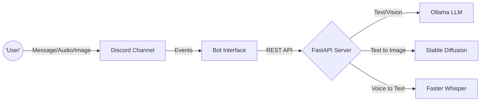

<div align="center">
  
</div>

<div align="center">
  
  
  
  
</div>

<br/>

## 🌟 The Problem
**Users juggle separate tools for text, image, and voice AI — creating a fragmented, inefficient, and frustrating experience.**

## 🧠 The Logic
**A FastAPI backend orchestrates three AI models — contextual chat, diffusion-based imaging, and real-time audio transcription — via unified endpoints.**

## 🚀 The Result
**A production-ready Discord assistant handling multimodal AI requests in real-time, eliminating external tools through seamless RESTful integration.**

---

<div align="center">
  <h2>🎥 See It In Action</h2>
  <p><i>Watch the bot generate images, transcribe audio, and chat seamlessly!</i></p>
  
  <!-- Replace the href link with your YouTube URL, and the img src with your video thumbnail -->
  <a href="URL_TO_YOUR_YOUTUBE_VIDEO">
    
  </a>
</div>

---

## 🔥 Key Features

<table align="center">
  <tr>
    <td align="center" width="33%">
      
      <br />
      <b>Image Recognition</b>
      <br />
      Understands images sent in chat using the <code>LLaVA</code> vision model.
    </td>
    <td align="center" width="33%">
      
      <br />
      <b>Voice to Text</b>
      <br />
      Listens and transcribes voice notes instantly with <code>Faster-Whisper</code>.
    </td>
    <td align="center" width="33%">
      
      <br />
      <b>AI Art Generation</b>
      <br />
      Paints stunning concepts using <code>Stable Diffusion v1-5</code>.
    </td>
  </tr>
</table>

---

## 🏗️ Architecture

The app is broken down into two microservices running in parallel:

> **🤖 The Frontend (Bot):** A `discord.py` client that watches for messages, audio clips, and image attachments, routing them to the internal APIs.
> 
> **⚙️ The Engine (Backend):** A `FastAPI` server driving heavy machine-learning workloads locally via `Torch`, `Transformers`, and `Ollama`.



---

## ⚡ Quick Commands

| Command | Action | Visual Example |
|---|---|---|
| `ai: <message>` | Prompts the AI (with memory context!) | 💬 |
| `image: <prompt>` | Generates a custom image. Includes regenerate UI. | 🎨 |
| `ai: clear` | Wipes the user's conversational memory. | 🧹 |
| *Attach Audio* | Bot auto-transcribes the `.ogg`/`.mp3`. | 🎙️ |
| *Attach Image* | Bot analyzes the image using Vision models. | 👁️ |

---

## 🛠️ How to Run Locally

### 1️⃣ Start the Backend AI Engine
```bash
cd backend
python -m venv .venv
.\.venv\Scripts\activate
pip install -r requirements.txt
uvicorn app.main:app --host 127.0.0.1 --port 8000
```
> *Note: First run will download ~4GB for Stable Diffusion models!*

### 2️⃣ Start the Discord Interface
Open a **new** terminal window:
```bash
cd bot
python -m venv .venv
.\.venv\Scripts\activate
pip install -r requirements.txt
python bot.py
```

---
<div align="center">
  
</div>
